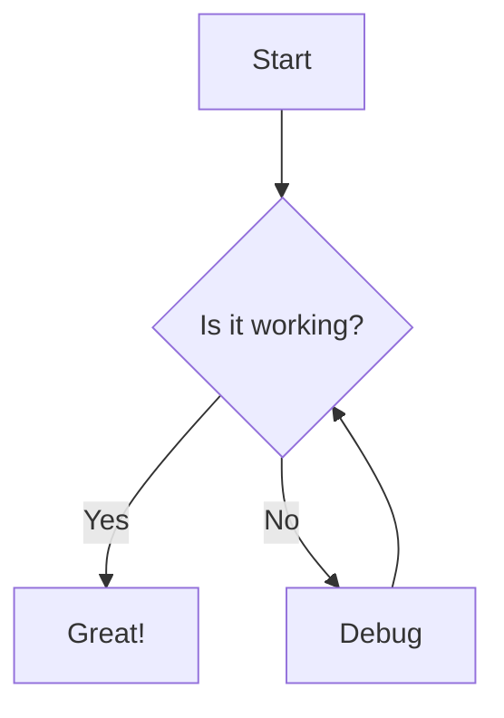

# Kate Neo Features Guide

This document provides comprehensive documentation for Kate Neo's features, including usage instructions and configuration options.

## Table of Contents

- [Drag-and-Drop Features](#drag-and-drop-features)
- [AI-Powered Suggestions](#ai-powered-suggestions)
- [Specialized Editors](#specialized-editors)
  - [Mermaid Diagrams](#mermaid-diagrams)
  - [Excalidraw Canvas](#excalidraw-canvas)
  - [OpenSCAD 3D Preview](#openscad-3d-preview)
- [Java Runtime & Apache Tomcat](#java-runtime--apache-tomcat)
- [API Reference](#api-reference)

---

## Drag-and-Drop Features

Kate Neo provides intuitive drag-and-drop functionality for file management and tab organization.

### File Tree Drag-and-Drop

Move files and folders within your project by dragging them in the file tree.

**How to Use:**
1. Click and hold on a file or folder in the file tree
2. Drag to the desired location
3. Visual indicators show where the item will be placed:
   - **Blue line above/below**: Item will be placed before/after the target
   - **Blue highlight**: Item will be moved inside the target folder
4. Release to complete the move

**Features:**
- Move files between folders
- Reorder files within a folder
- Move entire folders with their contents
- Visual drop indicators for precise placement

### Tab Reordering

Organize your open files by dragging tabs to reorder them.

**How to Use:**
1. Click and hold on any tab in the editor
2. Drag left or right to the desired position
3. A visual indicator shows where the tab will be placed
4. Release to complete the reorder

### External File Drop

Drop files from your desktop or file manager directly into Kate Neo.

**How to Use:**
1. Drag a file from your desktop or file manager
2. Drop it onto the file tree or editor area
3. The file will be imported into your project

**Supported Operations:**
- Drop onto a folder to add files to that folder
- Drop onto the root to add files to the project root
- Multiple file drop is supported

---

## AI-Powered Suggestions

Kate Neo includes intelligent suggestions for improving your project structure.

### File Organization Suggestions

The AI analyzes your file structure and suggests improvements.

**Suggestion Types:**

| Type | Description |
|------|-------------|
| `move` | Suggests moving a file to a more appropriate location |
| `organize` | Suggests grouping related files together |
| `rename` | Suggests renaming for consistent naming conventions |
| `group` | Suggests creating folders for scattered file types |
| `warning` | Alerts about potential issues (deep nesting, empty folders) |

### How It Works

1. **Automatic Analysis**: When you drag files, the AI evaluates the move
2. **Structure Scan**: Periodically scans your project for organization opportunities
3. **Confidence Scores**: Each suggestion includes a confidence level (0.0 - 1.0)

### Recommended File Structure

The AI uses these conventions to make suggestions:

| File Type | Recommended Location |
|-----------|---------------------|
| Components (`.tsx`, `.jsx`) | `src/components` |
| Styles (`.css`, `.scss`) | `src/styles` |
| Tests (`.test.ts`, `.spec.ts`) | `__tests__` |
| Types (`.d.ts`, `types.ts`) | `src/types` |
| Utilities (`utils.ts`, `helpers.ts`) | `src/lib` |
| Config files | Project root |
| Documentation (`.md`) | `docs` |
| Assets (images) | `public/assets` |
| 3D Models (`.scad`, `.stl`) | `models` |
| Diagrams (`.mmd`, `.excalidraw`) | `docs/diagrams` |
| Java (`.java`) | `src/main/java` |

### Using Suggestions

Suggestions appear in the sidebar when available:

```
┌─────────────────────────────────┐
│ AI Suggestions                  │
├─────────────────────────────────┤
│ ⚡ Group components files       │
│ Found 5 component files in      │
│ different locations.            │
│ [Apply] [Dismiss]               │
├─────────────────────────────────┤
│ ⚠ Deep folder nesting          │
│ "utils" is nested 6 levels deep │
│ [Dismiss]                       │
└─────────────────────────────────┘
```

---

## Specialized Editors

Kate Neo automatically opens specialized editors based on file type.

### Mermaid Diagrams

For `.mmd` and `.mermaid` files, Kate Neo provides a live preview editor.

**Supported Diagram Types:**
- Flowcharts
- Sequence diagrams
- Class diagrams
- State diagrams
- Entity Relationship diagrams
- Gantt charts
- Pie charts
- User Journey diagrams
- Git graphs

**Example Mermaid Syntax:**



**Editor Features:**

| Feature | Description |
|---------|-------------|
| Live Preview | See changes instantly as you type |
| Theme Selection | Choose from default, dark, forest, or neutral themes |
| Zoom Controls | Zoom in/out for detailed viewing |
| Pan | Click and drag to pan around large diagrams |
| Export SVG | Download diagram as scalable vector graphic |
| Export PNG | Download diagram as raster image |

**Keyboard Shortcuts:**
- `Ctrl/Cmd + +` - Zoom in
- `Ctrl/Cmd + -` - Zoom out
- `Ctrl/Cmd + 0` - Reset zoom
- `Ctrl/Cmd + S` - Save file

### Excalidraw Canvas

For `.excalidraw` files, Kate Neo opens the Excalidraw whiteboard editor.

**Tools Available:**
- Selection tool
- Rectangle, ellipse, diamond shapes
- Line and arrow tools
- Freehand drawing
- Text tool
- Eraser

**Features:**

| Feature | Description |
|---------|-------------|
| Infinite Canvas | Unlimited drawing space |
| Shapes | Geometric shapes with customizable colors |
| Freehand | Natural drawing with pressure sensitivity |
| Text | Add text labels and annotations |
| Arrows | Connect shapes with arrows |
| Styling | Customize colors, stroke width, fill |
| Export SVG | Export as scalable vector |
| Export PNG | Export as raster image |

**Keyboard Shortcuts:**
- `V` - Selection tool
- `R` - Rectangle
- `O` - Ellipse
- `D` - Diamond
- `A` - Arrow
- `L` - Line
- `P` - Pencil (freehand)
- `T` - Text
- `E` - Eraser
- `Ctrl/Cmd + Z` - Undo
- `Ctrl/Cmd + Shift + Z` - Redo

### OpenSCAD 3D Preview

For `.scad` files, Kate Neo provides a 3D model preview with parameter editing.

**Features:**

| Feature | Description |
|---------|-------------|
| 3D Preview | Real-time WebGL rendering |
| Parameter Editor | Modify OpenSCAD variables interactively |
| Camera Controls | Rotate, zoom, and pan the view |
| Grid Display | Optional grid for scale reference |
| Axes Display | X/Y/Z axes visualization |
| Export STL | Download as 3D printable STL file |
| Export PNG | Screenshot of current view |
| Export SVG | 2D projection of the model |

**Camera Controls:**
- **Rotate**: Click and drag
- **Zoom**: Mouse wheel or pinch gesture
- **Pan**: Right-click and drag or two-finger drag

**Parameter Editing:**

OpenSCAD parameters are automatically detected and displayed:

```
┌─────────────────────────────────┐
│ Parameters                      │
├─────────────────────────────────┤
│ width:  [====50====]            │
│ height: [====30====]            │
│ depth:  [====20====]            │
│ hollow: [✓]                     │
│ [Render]                        │
└─────────────────────────────────┘
```

**Supported OpenSCAD Constructs:**
- Primitives: `cube`, `sphere`, `cylinder`, `polyhedron`
- Transformations: `translate`, `rotate`, `scale`, `mirror`
- Boolean operations: `union`, `difference`, `intersection`
- Modules and functions
- Variables and parameters

---

## Java Runtime & Apache Tomcat

Kate Neo includes integrated Java development and deployment capabilities.

### Prerequisites

To use Java features, you need:
- **JDK 11+** installed and `JAVA_HOME` environment variable set
- **Apache Tomcat 9+** for servlet features (optional)

### Java Compilation

Compile Java source files directly from the IDE.

**Via API:**
```typescript
POST /api/java/compile
{
  "sourceFiles": ["src/Main.java", "src/Utils.java"],
  "outputDir": "build/classes",
  "classpath": ["lib/dependency.jar"]
}
```

**Response:**
```json
{
  "success": true,
  "errors": [],
  "warnings": [],
  "outputDir": "build/classes"
}
```

### Java Execution

Run compiled Java applications.

**Via API:**
```typescript
POST /api/java/run
{
  "className": "com.example.Main",
  "classpath": ["build/classes", "lib/*"],
  "args": ["--verbose"],
  "workingDir": "/path/to/project"
}
```

**Response:**
```json
{
  "exitCode": 0,
  "stdout": "Hello, World!\n",
  "stderr": "",
  "duration": 1234
}
```

### Apache Tomcat Integration

Deploy and manage Java servlets with the integrated Tomcat server.

**Starting Tomcat:**
```typescript
POST /api/tomcat/start
```

**Stopping Tomcat:**
```typescript
POST /api/tomcat/stop
```

**Checking Status:**
```typescript
GET /api/tomcat/status

// Response:
{
  "running": true,
  "port": 8080,
  "deployedApps": ["myapp", "api"]
}
```

### Servlet Deployment

Deploy servlets to the integrated Tomcat server.

**Deploy a WAR file:**
```typescript
POST /api/tomcat/deploy
{
  "name": "myapp",
  "source": "/path/to/myapp.war",
  "contextPath": "/myapp"
}
```

**Deploy from source:**
```typescript
POST /api/tomcat/deploy
{
  "name": "myapp",
  "source": "/path/to/webapp",
  "contextPath": "/myapp"
}
```

**Undeploy:**
```typescript
DELETE /api/tomcat/deploy/myapp
```

### Creating Servlet Projects

Generate a new servlet project with the standard structure.

**Via API:**
```typescript
POST /api/java/create-servlet-project
{
  "projectPath": "/path/to/new-project",
  "groupId": "com.example",
  "artifactId": "mywebapp",
  "version": "1.0.0"
}
```

**Generated Structure:**
```
new-project/
├── src/
│   └── main/
│       ├── java/
│       │   └── com/example/
│       │       └── HelloServlet.java
│       └── webapp/
│           ├── WEB-INF/
│           │   └── web.xml
│           └── index.html
├── pom.xml
└── build.xml
```

---

## API Reference

### Drag-and-Drop Events

```typescript
// FileTree component props
interface FileTreeProps {
  files: FileNode[];
  onFileMove?: (sourceId: string, targetId: string, position: 'before' | 'after' | 'inside') => void;
  onExternalFileDrop?: (files: FileList, targetFolderId?: string) => void;
}

// TabBar component props
interface TabBarProps {
  tabs: Tab[];
  onTabReorder?: (sourceIndex: number, targetIndex: number) => void;
}
```

### AI Suggestions Hook

```typescript
import { useDragDropAI } from '@/hooks/useDragDropAI';

const {
  suggestions,      // Current suggestions array
  isAnalyzing,      // Whether analysis is in progress
  analyzeDragDrop,  // Analyze a specific drag-drop operation
  analyzeFileStructure, // Analyze entire project structure
  dismissSuggestion,    // Dismiss a suggestion by ID
  applySuggestion,      // Apply a suggestion by ID
} = useDragDropAI(files, { enabled: true });
```

### Java Service API

| Endpoint | Method | Description |
|----------|--------|-------------|
| `/api/java/compile` | POST | Compile Java source files |
| `/api/java/run` | POST | Run a Java application |
| `/api/java/create-servlet-project` | POST | Create servlet project |
| `/api/tomcat/start` | POST | Start Tomcat server |
| `/api/tomcat/stop` | POST | Stop Tomcat server |
| `/api/tomcat/status` | GET | Get Tomcat status |
| `/api/tomcat/deploy` | POST | Deploy application |
| `/api/tomcat/deploy/:name` | DELETE | Undeploy application |

### OpenSCAD Service API

| Endpoint | Method | Description |
|----------|--------|-------------|
| `/api/openscad/render` | POST | Render OpenSCAD code |
| `/api/openscad/validate` | POST | Validate syntax |
| `/api/openscad/export` | POST | Export to STL/PNG/SVG |
| `/api/openscad/templates` | GET | Get code templates |

---

## Configuration

### Environment Variables

| Variable | Description | Default |
|----------|-------------|---------|
| `JAVA_HOME` | Path to JDK installation | (required for Java) |
| `CATALINA_HOME` | Path to Tomcat installation | (required for Tomcat) |
| `OPENSCAD_PATH` | Path to OpenSCAD binary | `/usr/bin/openscad` |

### Settings

Configure features in Settings > Extensions:

```json
{
  "java.home": "/usr/lib/jvm/java-17-openjdk",
  "java.classpath": ["lib/*"],
  "tomcat.port": 8080,
  "tomcat.autoStart": false,
  "openscad.path": "/usr/bin/openscad",
  "openscad.defaultResolution": 50,
  "mermaid.theme": "default",
  "excalidraw.gridSize": 20
}
```

---

## Troubleshooting

### Java Features Not Working

1. Verify `JAVA_HOME` is set correctly:
   ```bash
   echo $JAVA_HOME
   java -version
   ```

2. Ensure the JDK (not just JRE) is installed

3. Check the server logs for detailed error messages

### Tomcat Won't Start

1. Check if port 8080 is already in use:
   ```bash
   lsof -i :8080
   ```

2. Verify `CATALINA_HOME` points to a valid Tomcat installation

3. Ensure Tomcat's `bin/startup.sh` has execute permissions

### OpenSCAD Preview Empty

1. Verify OpenSCAD is installed:
   ```bash
   openscad --version
   ```

2. Check if the `.scad` file has valid syntax

3. Ensure the model isn't too complex (reduce `$fn` value)

### Mermaid Diagrams Not Rendering

1. Check the browser console for errors

2. Verify the diagram syntax is correct

3. Try a simpler diagram to isolate the issue

---

## See Also

- [README.md](../README.md) - Project overview
- [AI_INTEGRATION.md](AI_INTEGRATION.md) - AI assistant configuration
- [CONTRIBUTING.md](../CONTRIBUTING.md) - Contribution guidelines
